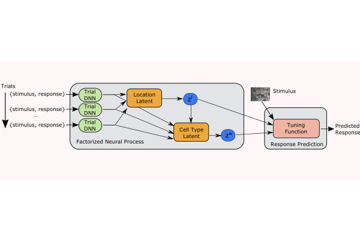

# Training the model

    PYTHONPATH="." python tuning_manifold/train.py \ 
                   --architecture='{"architecture": [[11, 32], [5, 8], [3, 8], [3, 8], 64], "padding": "same", "norm": "batch", "nb_orientations": 8}' \
                   --cell_latent_dim=64 --synthetic_rf_dim=8 --image_shape="(16,16,1)"
                   
# Contents

The main files and directories for this project are
* ``tuning_manifold`` -- the python project directory
* ``tuning_manifold/train.py`` -- the training script
* ``tuning_manifold/fnp_model.py`` -- the Factorized Neural Process model
* ``tuning_manifold/synthetic_sampler.py`` -- generate TF Datasets of simulated responses
* ``tuning_manifold/se2cnn`` -- the G-CNN library
